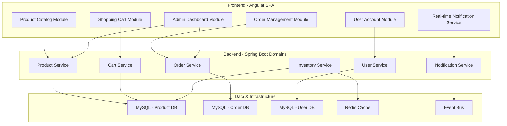
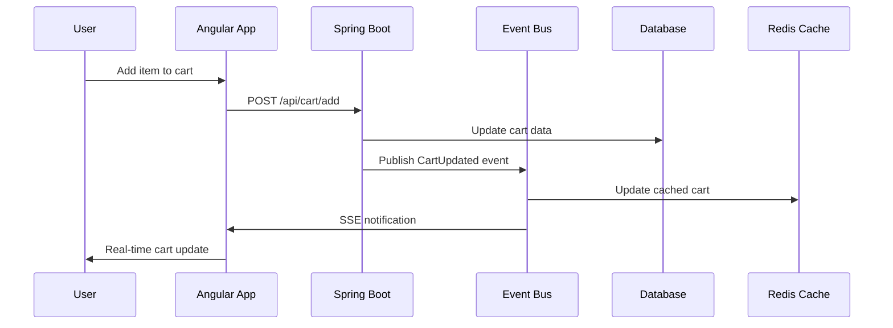

# Ecommerce Website Design Document

## Overview

The real-time ecommerce website will be built using a microservices-inspired modular architecture with clear domain boundaries. The system will feature a reactive Angular frontend, a Spring Boot backend organized around business domains, and MySQL with optimized schemas for high-performance ecommerce operations. Real-time capabilities will be achieved through Server-Sent Events (SSE) and WebSocket integration for different use cases.

## Architecture

### Domain-Driven Modular Architecture



### Technology Stack Integration

- **Frontend**: Angular 17+ with standalone components, NgRx for state management, Angular Material UI
- **Backend**: Spring Boot 3.x with domain-driven service organization, Spring Security, Spring Data JPA
- **Database**: MySQL 8.0 with domain-specific database schemas and read replicas
- **Caching**: Redis for session management and frequently accessed data
- **Real-time**: Server-Sent Events (SSE) for notifications, WebSocket for cart synchronization
- **Security**: OAuth2 with JWT tokens, role-based access control

## Components and Interfaces

### Frontend Components

#### Core Angular Modules
- **ProductModule**: Product listing, search, and detail components
- **CartModule**: Shopping cart management and checkout flow
- **UserModule**: Authentication, registration, and profile management
- **AdminModule**: Product and order management interfaces
- **SharedModule**: Common components, pipes, and services

#### Key Services
- **ProductService**: Handles product CRUD operations and search
- **CartService**: Manages shopping cart state and persistence
- **OrderService**: Processes checkout and order tracking
- **WebSocketService**: Manages real-time connections and message handling
- **AuthService**: Handles user authentication and authorization

### Backend Components

#### REST API Controllers
- **ProductController**: `/api/products` - Product management endpoints
- **CartController**: `/api/cart` - Shopping cart operations
- **OrderController**: `/api/orders` - Order processing and tracking
- **UserController**: `/api/users` - User account management
- **AdminController**: `/api/admin` - Administrative functions

#### Service Layer
- **ProductService**: Business logic for product operations
- **CartService**: Shopping cart management and validation
- **OrderService**: Order processing and fulfillment logic
- **InventoryService**: Stock management and real-time updates
- **NotificationService**: Real-time notification handling

#### WebSocket Configuration
- **WebSocketConfig**: STOMP endpoint configuration
- **WebSocketController**: Real-time message handling
- **WebSocketSecurity**: Authentication for WebSocket connections

## Data Models

### Domain-Specific Database Design

#### User Domain Schema
```sql
-- User Management Database
CREATE TABLE users (
    id BIGINT PRIMARY KEY AUTO_INCREMENT,
    email VARCHAR(255) UNIQUE NOT NULL,
    password_hash VARCHAR(255) NOT NULL,
    first_name VARCHAR(100) NOT NULL,
    last_name VARCHAR(100) NOT NULL,
    phone VARCHAR(20),
    role ENUM('CUSTOMER', 'ADMIN') DEFAULT 'CUSTOMER',
    is_active BOOLEAN DEFAULT TRUE,
    email_verified BOOLEAN DEFAULT FALSE,
    created_at TIMESTAMP DEFAULT CURRENT_TIMESTAMP,
    updated_at TIMESTAMP DEFAULT CURRENT_TIMESTAMP ON UPDATE CURRENT_TIMESTAMP,
    INDEX idx_email (email),
    INDEX idx_role (role)
);

CREATE TABLE user_addresses (
    id BIGINT PRIMARY KEY AUTO_INCREMENT,
    user_id BIGINT NOT NULL,
    type ENUM('SHIPPING', 'BILLING') NOT NULL,
    street_address VARCHAR(255) NOT NULL,
    city VARCHAR(100) NOT NULL,
    state VARCHAR(100) NOT NULL,
    postal_code VARCHAR(20) NOT NULL,
    country VARCHAR(100) NOT NULL,
    is_default BOOLEAN DEFAULT FALSE,
    FOREIGN KEY (user_id) REFERENCES users(id) ON DELETE CASCADE,
    INDEX idx_user_type (user_id, type)
);
```

#### Product Domain Schema
```sql
-- Product Catalog Database
CREATE TABLE categories (
    id BIGINT PRIMARY KEY AUTO_INCREMENT,
    name VARCHAR(255) NOT NULL,
    description TEXT,
    parent_id BIGINT,
    is_active BOOLEAN DEFAULT TRUE,
    created_at TIMESTAMP DEFAULT CURRENT_TIMESTAMP,
    FOREIGN KEY (parent_id) REFERENCES categories(id),
    INDEX idx_parent (parent_id),
    INDEX idx_active (is_active)
);

CREATE TABLE products (
    id BIGINT PRIMARY KEY AUTO_INCREMENT,
    sku VARCHAR(100) UNIQUE NOT NULL,
    name VARCHAR(255) NOT NULL,
    description TEXT,
    price DECIMAL(12,2) NOT NULL,
    category_id BIGINT NOT NULL,
    brand VARCHAR(100),
    weight DECIMAL(8,2),
    dimensions VARCHAR(100),
    is_active BOOLEAN DEFAULT TRUE,
    created_at TIMESTAMP DEFAULT CURRENT_TIMESTAMP,
    updated_at TIMESTAMP DEFAULT CURRENT_TIMESTAMP ON UPDATE CURRENT_TIMESTAMP,
    FOREIGN KEY (category_id) REFERENCES categories(id),
    INDEX idx_category (category_id),
    INDEX idx_active (is_active),
    INDEX idx_sku (sku),
    FULLTEXT idx_search (name, description)
);

CREATE TABLE product_inventory (
    product_id BIGINT PRIMARY KEY,
    quantity_available INT NOT NULL DEFAULT 0,
    quantity_reserved INT NOT NULL DEFAULT 0,
    reorder_level INT DEFAULT 10,
    last_updated TIMESTAMP DEFAULT CURRENT_TIMESTAMP ON UPDATE CURRENT_TIMESTAMP,
    FOREIGN KEY (product_id) REFERENCES products(id) ON DELETE CASCADE,
    INDEX idx_low_stock (quantity_available, reorder_level)
);

CREATE TABLE product_images (
    id BIGINT PRIMARY KEY AUTO_INCREMENT,
    product_id BIGINT NOT NULL,
    image_url VARCHAR(500) NOT NULL,
    alt_text VARCHAR(255),
    display_order INT DEFAULT 0,
    is_primary BOOLEAN DEFAULT FALSE,
    FOREIGN KEY (product_id) REFERENCES products(id) ON DELETE CASCADE,
    INDEX idx_product_order (product_id, display_order)
);
```

#### Order Domain Schema
```sql
-- Order Management Database
CREATE TABLE orders (
    id BIGINT PRIMARY KEY AUTO_INCREMENT,
    order_number VARCHAR(50) UNIQUE NOT NULL,
    user_id BIGINT NOT NULL,
    status ENUM('PENDING', 'CONFIRMED', 'PROCESSING', 'SHIPPED', 'DELIVERED', 'CANCELLED', 'REFUNDED') DEFAULT 'PENDING',
    subtotal DECIMAL(12,2) NOT NULL,
    tax_amount DECIMAL(12,2) NOT NULL DEFAULT 0,
    shipping_amount DECIMAL(12,2) NOT NULL DEFAULT 0,
    total_amount DECIMAL(12,2) NOT NULL,
    currency VARCHAR(3) DEFAULT 'USD',
    payment_status ENUM('PENDING', 'PAID', 'FAILED', 'REFUNDED') DEFAULT 'PENDING',
    shipping_address_id BIGINT,
    billing_address_id BIGINT,
    notes TEXT,
    created_at TIMESTAMP DEFAULT CURRENT_TIMESTAMP,
    updated_at TIMESTAMP DEFAULT CURRENT_TIMESTAMP ON UPDATE CURRENT_TIMESTAMP,
    INDEX idx_user (user_id),
    INDEX idx_status (status),
    INDEX idx_order_number (order_number),
    INDEX idx_created_at (created_at)
);

CREATE TABLE order_items (
    id BIGINT PRIMARY KEY AUTO_INCREMENT,
    order_id BIGINT NOT NULL,
    product_id BIGINT NOT NULL,
    product_sku VARCHAR(100) NOT NULL,
    product_name VARCHAR(255) NOT NULL,
    quantity INT NOT NULL,
    unit_price DECIMAL(12,2) NOT NULL,
    total_price DECIMAL(12,2) NOT NULL,
    FOREIGN KEY (order_id) REFERENCES orders(id) ON DELETE CASCADE,
    INDEX idx_order (order_id),
    INDEX idx_product (product_id)
);

CREATE TABLE shopping_cart (
    id BIGINT PRIMARY KEY AUTO_INCREMENT,
    user_id BIGINT,
    session_id VARCHAR(255),
    product_id BIGINT NOT NULL,
    quantity INT NOT NULL,
    created_at TIMESTAMP DEFAULT CURRENT_TIMESTAMP,
    updated_at TIMESTAMP DEFAULT CURRENT_TIMESTAMP ON UPDATE CURRENT_TIMESTAMP,
    UNIQUE KEY unique_user_product (user_id, product_id),
    UNIQUE KEY unique_session_product (session_id, product_id),
    INDEX idx_user (user_id),
    INDEX idx_session (session_id)
);
```

#### JPA Entity Relationships
- **User** (1:N) **Order**: One user can have multiple orders
- **Order** (1:N) **OrderItem**: One order contains multiple items
- **Product** (1:N) **OrderItem**: One product can be in multiple orders
- **User** (1:N) **CartItem**: One user can have multiple cart items
- **Product** (1:N) **CartItem**: One product can be in multiple carts

## Error Handling

### Frontend Error Handling
- **HTTP Interceptor**: Global error handling for API calls
- **Error Service**: Centralized error logging and user notification
- **Validation**: Form validation with real-time feedback
- **Offline Handling**: Graceful degradation when network is unavailable

### Backend Error Handling
- **Global Exception Handler**: Centralized exception processing
- **Custom Exceptions**: Business-specific error types
- **Validation**: Input validation with detailed error messages
- **Transaction Management**: Rollback on business logic failures

### Error Response Format
```json
{
  "timestamp": "2024-01-15T10:30:00Z",
  "status": 400,
  "error": "Bad Request",
  "message": "Product quantity exceeds available inventory",
  "path": "/api/cart/add",
  "details": {
    "field": "quantity",
    "rejectedValue": 10,
    "availableQuantity": 5
  }
}
```

## Real-Time Implementation

### Hybrid Real-Time Architecture
- **Server-Sent Events (SSE)**: One-way communication for notifications and updates
- **WebSocket**: Bidirectional communication for cart synchronization and admin features
- **Event-Driven Design**: Domain events trigger real-time updates across services
- **Connection Resilience**: Automatic reconnection with circuit breaker pattern

### Real-Time Communication Strategy
1. **SSE for Notifications**: Order updates, inventory alerts, promotional messages
2. **WebSocket for Collaboration**: Multi-device cart sync, admin real-time dashboard
3. **Polling Fallback**: Graceful degradation for unsupported browsers
4. **Event Sourcing**: Audit trail and replay capability for critical operations

### Event Flow Architecture


## Security Implementation

### Authentication & Authorization
- **JWT Tokens**: Stateless authentication with refresh token rotation
- **Role-Based Access**: Customer and Admin role separation
- **Password Security**: BCrypt hashing with salt
- **Session Management**: Secure token storage and validation

### API Security
- **CORS Configuration**: Restricted cross-origin requests
- **Rate Limiting**: API endpoint throttling
- **Input Validation**: Comprehensive request validation
- **SQL Injection Prevention**: Parameterized queries through Hibernate

### Data Protection
- **HTTPS Enforcement**: All communications encrypted
- **Sensitive Data**: PII encryption at rest
- **Audit Logging**: Security event tracking
- **Database Security**: Connection encryption and access controls

## Testing Strategy

### Frontend Testing
- **Unit Tests**: Component and service testing with Jasmine/Karma
- **Integration Tests**: API integration testing
- **E2E Tests**: User workflow testing with Cypress
- **Real-time Testing**: WebSocket connection and message handling tests

### Backend Testing
- **Unit Tests**: Service layer testing with JUnit 5 and Mockito
- **Integration Tests**: Repository and API endpoint testing
- **Security Tests**: Authentication and authorization validation
- **Performance Tests**: Load testing for concurrent users and real-time connections

### Database Testing
- **Migration Tests**: Schema change validation
- **Performance Tests**: Query optimization and indexing validation
- **Data Integrity Tests**: Constraint and relationship validation

## Performance Considerations

### Frontend Performance Strategy
- **Micro-Frontend Approach**: Independently deployable feature modules
- **Progressive Loading**: Critical path optimization with skeleton screens
- **State Management**: NgRx with entity adapters for normalized data
- **Virtual Scrolling**: Efficient rendering of large product lists
- **Service Workers**: Offline capability and background sync

### Backend Performance Strategy
- **CQRS Pattern**: Separate read and write operations for optimal performance
- **Database Sharding**: Horizontal scaling by domain (users, products, orders)
- **Event Sourcing**: Append-only event store for audit and replay capabilities
- **Async Processing**: Message queues for order processing and notifications
- **API Gateway**: Rate limiting, caching, and request routing

### Scalability Architecture
- **Read Replicas**: Separate read databases for product catalog queries
- **CDN Integration**: Static asset delivery and image optimization
- **Horizontal Scaling**: Stateless services with load balancing
- **Caching Layers**: Multi-level caching (browser, CDN, application, database)
- **Monitoring**: Real-time performance metrics and alerting